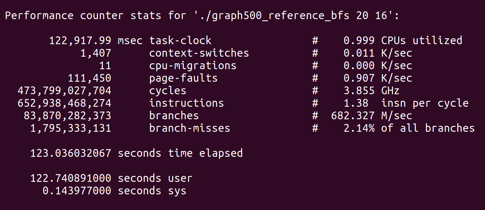

# 性能分析工具的学习与使用

## 邹永浩
## 2019211168

### 1. Graph500 的使用

在官网下载graph500之后，直接`make`即可编译出`graph500_reference_bfs`和`graph500_reference_bfs_sssp`，直接使用这两个程序即可。

根据官网提供的数据,如下图所示


结合机器性能，参数设定为 SCALE <= 26，EDGE FACTOR = 16 较为合理。

### 2. strace

`strace` 可以查看程序的系统调用，直接在程序调用前使用即可。
```bash script
strace graph500_reference_bfs 16 16
```


可以看到系统调用的函数名，调用参数和返回值，如果有错误还可以看到简单的错误信息。

### 3. perf

`Ubuntu`下需要根据内核版本安装

`sudo apt install linux-tools-5.3.0-40-generic`

`perf`的功能十分强大，不过有些指令需要相应内核和权限

`perf top` 可以实时显示性能统计信息


`perf stat` 分析程序整体性能

`perf stat ./graph500_reference_bfs 20 16`



### 4. vmstat

`vmstat` 可以展现给定时间间隔的状态值,包括CPU使用率，内存使用，虚拟内存交换情况,IO读写情况。

通过两个数字参数来完成的，第一个参数是采样的时间间隔数，单位是秒，第二个参数是采样的次数。


### 5. dstat

`dstat`也是一个性能统计工具，可以通过参数制定显示内容。


### 6. free

`free`命令可以显示当前系统未使用的和已使用的内存数目，还可以显示被内核使用的内存缓冲区。


可以看到开启程序后内存占用为3.3G。

### 7. iostat

iostat可以显示CPU和I/O系统的负载情况及分区状态信息。


### 8. mpstat

`mpstat`用于获取 CPU 相关统计信息.


### 9. nicstat

nicstat可以统计网络流量

