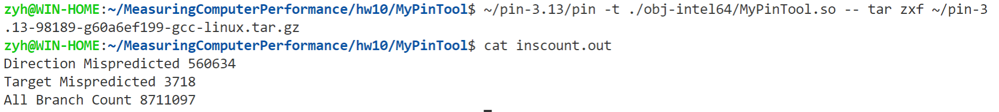

# 用PIN对程序中的分支情况进行分析

## 邹永浩

## 2019211168

### 编译环境

下载`PIN`源码后，拷贝`MyPinTool`出来，修改`makefile`中加入`PIN_ROOT`变量，指向`PIN`源码目录即可编译。

### `BranchPredictor` 和 `BP_Info`

根据PPT，我们只要编写以上两个类或者数据结构即可，代码如下：

```cpp
struct BP_Info
{
    bool Taken = false;
    ADDRINT predTarget = 0;
    int takenCount = 0;
};

class BranchPredictor
{
private:
    std::map<ADDRINT, struct BP_Info> predictMap;

public:
    BP_Info GetPrediction(ADDRINT PC)
    {
        BP_Info result;
        result.Taken = false;
        result.predTarget = -1;
        result.predTarget = predictMap[PC].predTarget;
        if (predictMap[PC].takenCount > 1)
        {
            result.Taken = true;
        }
        return result;
    }

    void Update(ADDRINT PC, bool BrTaken, ADDRINT targetPC)
    {
        if (predictMap[PC].predTarget != 0)
        {
            // taken
            if (pred.predTarget == targetPC && BrTaken)
            {
                if (pred.takenCount < 4)
                {
                    pred.takenCount++;
                }
            }
            else
            {
                if (pred.takenCount > 0)
                {
                    pred.takenCount--;
                }
                if (pred.takenCount ==0 && BrTaken)
                {
                    // 这里加了一点逻辑，如果takenCount为0，且预测地址跟实际地址不匹配
                    // 则更新跳转地址，实际测试可以提高一点点准确率
                    pred.predTarget = targetPC;
                }
            }
        }
        else
        {
            BP_Info newInfo;
            newInfo.predTarget = targetPC;
            if (BrTaken)
            {
                newInfo.takenCount = 3;
            }
            else
            {
                newInfo.takenCount = 0;
            }
            predictMap[PC] = newInfo;
        }
    }
};
```

### 总体逻辑

总体逻辑基本参考PPT，加了一些统计变量

```cpp
static UINT64 directionMispredictedCount = 0;
static UINT64 targetMispredictedCount = 0;
static UINT64 allBranchCount = 0;

BranchPredictor myBPU;

VOID ProcessBranch(ADDRINT PC, ADDRINT targetPC, bool BrTaken)
{
    BP_Info pred = myBPU.GetPrediction(PC);

    // std::cout << pred.Taken << ", " << pred.takenCount << std::endl;

    if (pred.Taken != BrTaken)
    {
        // Direction Mispredicted
        directionMispredictedCount++;
    }
    if (pred.predTarget != targetPC)
    {
        // Target Mispredicted
        targetMispredictedCount++;
    }

    allBranchCount++;

    myBPU.Update(PC, BrTaken, targetPC);
}

// Pin calls this function every time a new instruction is encountered
VOID Instruction(INS ins, VOID *v)
{
    if (INS_IsBranch(ins) && INS_HasFallThrough(ins))
    {
        INS_InsertCall(ins,
                       IPOINT_BEFORE,
                       (AFUNPTR)ProcessBranch,
                       IARG_ADDRINT,
                       INS_Address(ins),
                       IARG_ADDRINT,
                       INS_DirectControlFlowTargetAddress(ins),
                       IARG_BRANCH_TAKEN,
                       IARG_END);
    }
}

// ...

int main(int argc, char *argv[])
{
    // Initialize pin
    if (PIN_Init(argc, argv))
        return Usage();
    OutFile.open(KnobOutputFile.Value().c_str());
    // Register Instruction to be called to instrument instructions
    INS_AddInstrumentFunction(Instruction, 0);
    // Register Fini to be called when the application exits
    PIN_AddFiniFunction(Fini, 0);

    // Start the program, never returns
    PIN_StartProgram();

    return 0;
}
```

### 结果

直接`make`之后，产生`obj-intel64`文件夹下`MyPinTool.so`文件，运行命令为：

```
~/pin-3.13/pin -t ./obj-intel64/MyPinTool.so -- tar zxf ~/pin-3.13-98189-g60a6ef199-gcc-linux.tar.gz
```

这里直接测试解压`pin`源码，结果如下：



可以看到，预测成功率约为93.5%

### 参考文献

https://www.cnblogs.com/linhaostudy/p/9193162.html

https://software.intel.com/sites/landingpage/pintool/docs/98189/Pin/html/index.html#EXAMPLES