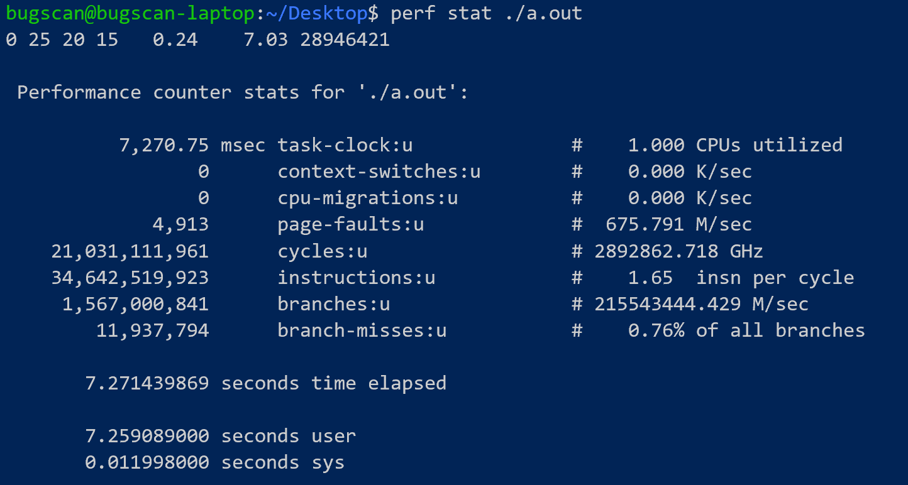
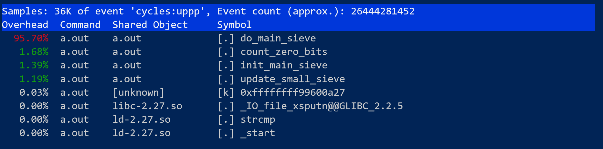
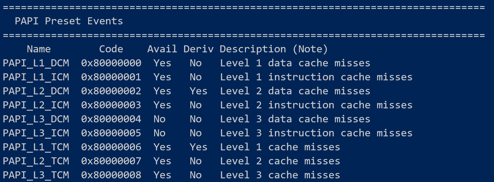

# perf工具及PAPI的使用

## 邹永浩

## 2019211168

### `perf`分析热点

因为我是自己编译的内核，所以需要进入内核目录下`tools/perf`进行编译安装，直接`make`再`make install`就可以了。

首先对程序运行概况进行分析，使用`perf stat`查看：

可以看到程序是纯计算类的，因为`task-clock`为1.

进一步分析程序热点，使用`perf record`记录，再使用`perf report`查看结果：

可以看到，程序热点函数为`do_main_sieve`，如果需要进行优化，应重点关注该函数。

### `PAPI`采集指标

安装`PAPI`比较简单，只要把源码下载编译安装即可，编译完成后，我们可以通过`utils/papi_avail`查看支持的事件，如下图所示：

可以看到`PAPI`支持查看各类缓存的数据或者指令miss，不过我这里直接统计总体miss情况。

不过我们需要修改被测程序，添加如下代码：

### 参考文献

https://www.ibm.com/developerworks/cn/linux/l-cn-perf1/index.html

