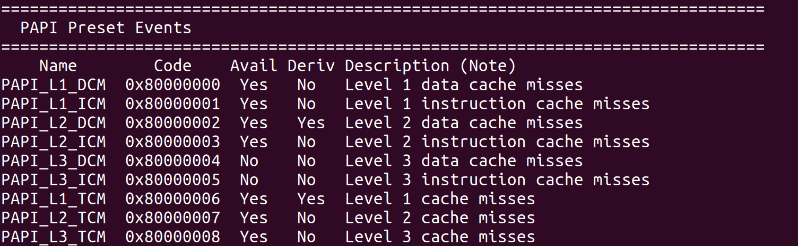

# perf工具及PAPI的使用

## 邹永浩

## 2019211168

### `perf`分析热点

因为我是自己编译的内核，所以需要进入内核目录下`tools/perf`进行编译安装，直接`make`再`make install`就可以了。

首先对程序运行概况进行分析，使用`perf stat`查看：


可以看到程序是纯计算类的，因为`task-clock`为1.

进一步分析程序热点，使用`perf record`记录，再使用`perf report`查看结果：


可以看到，程序热点函数为`do_main_sieve`，如果需要进行优化，应重点关注该函数。

### `PAPI`采集指标

安装`PAPI`比较简单，只要把源码下载编译安装即可，编译完成后，我们可以通过`utils/papi_avail`查看支持的事件，如下图所示：



可以看到`PAPI`支持查看各类缓存的数据或者指令miss，在我的机器上, 有很多指标无法统计, 其中影响实验的是`PAPI_L1_TCA` 以及 `PAPI_TLB_TL` , 因此我在测试`L1 cache`时仅统计了miss的次数, 对于`TLB`的 miss rate 则未统计.

修改被测程序，添加如下代码：

```c++
// ...
#include <papi.h>
// ...
int main(int argc, char **argv)
{
  /* Initialize the PAPI library */
  if (PAPI_library_init(PAPI_VER_CURRENT) != PAPI_VER_CURRENT)
    exit(1);
  /* Create an EventSet */
  int EventSet = PAPI_NULL;
  int retval = PAPI_create_eventset(&EventSet);
  assert(retval == PAPI_OK);

  /* Total cycles */
  retval = PAPI_add_event(EventSet, PAPI_TOT_CYC);
  assert(retval == PAPI_OK);
  /* Instructions completed */
  retval = PAPI_add_event(EventSet, PAPI_TOT_INS);
  assert(retval == PAPI_OK);

  /* L1 cache miss */
  retval = PAPI_add_event(EventSet, PAPI_L1_TCM);
  assert(retval == PAPI_OK);
  /* L1 cache access */
  // retval = PAPI_add_event(EventSet, PAPI_L1_TCA);
  // assert(retval == PAPI_OK);
  /* L2 cache miss */
  retval = PAPI_add_event(EventSet, PAPI_L2_TCM);
  assert(retval == PAPI_OK);
  /* L2 cache access */
  retval = PAPI_add_event(EventSet, PAPI_L2_TCA);
  assert(retval == PAPI_OK);
  /* L3 cache miss */
  retval = PAPI_add_event(EventSet, PAPI_L3_TCM);
  assert(retval == PAPI_OK);
  /* L3 cache access */
  retval = PAPI_add_event(EventSet, PAPI_L3_TCA);
  assert(retval == PAPI_OK);

  /* TLB miss */
  // retval = PAPI_add_event(EventSet, PAPI_TLB_TL);
  // assert(retval == PAPI_OK);

  /* branch mispredict */
  retval = PAPI_add_event(EventSet, PAPI_BR_MSP);
  assert(retval == PAPI_OK);
  /* branch */
  retval = PAPI_add_event(EventSet, PAPI_BR_CN);
  assert(retval == PAPI_OK);

  /* Start counting events */
  if (PAPI_start(EventSet) != PAPI_OK)
    retval = PAPI_start(EventSet);
  assert(retval == PAPI_OK);

  long long values1[9];
  long long values2[9];
  PAPI_read(EventSet, values1);
  assert(retval == PAPI_OK);
  
  // logic ignored

  /* Stop counting events */
  retval = PAPI_stop(EventSet, values2);
  assert(retval == PAPI_OK);

  int index = 0;
  printf("CPI: %f\n", (values2[index] - values1[index]) / 1.0 / (values2[index + 1] - values1[index + 1]));
  index += 2;
  printf("L1 cache miss: %lld\n", (values2[index] - values1[index]));
  index++;
  printf("L2 cache miss rate: %f\n", (values2[index] - values1[index]) / 1.0 / (values2[index + 1] - values1[index + 1]));
  index += 2;
  printf("L3 cache miss rate: %f\n", (values2[index] - values1[index]) / 1.0 / (values2[index + 1] - values1[index + 1]));

  // printf("TLB cache miss: %lld\n", (values2[8] - values1[8]));

  index += 2;
  printf("Branch miss prediction rate: %f\n", (values2[index] - values1[index]) / 1.0 / (values2[index + 1] - values1[index + 1]));

  /* Clean up EventSet */
  if (PAPI_cleanup_eventset(EventSet) != PAPI_OK)
    exit(-1);

  /* Destroy the EventSet */
  if (PAPI_destroy_eventset(&EventSet) != PAPI_OK)
    exit(-1);

  /* Shutdown PAPI */
  PAPI_shutdown();

  return 0;
}
```

编译命令如下:

```bash
gcc prime_sieve-64.c /usr/local/lib/libpapi.a
```

运行结果为:


### 参考文献

https://www.ibm.com/developerworks/cn/linux/l-cn-perf1/index.html

https://www.cnblogs.com/dmyu/p/4648413.html