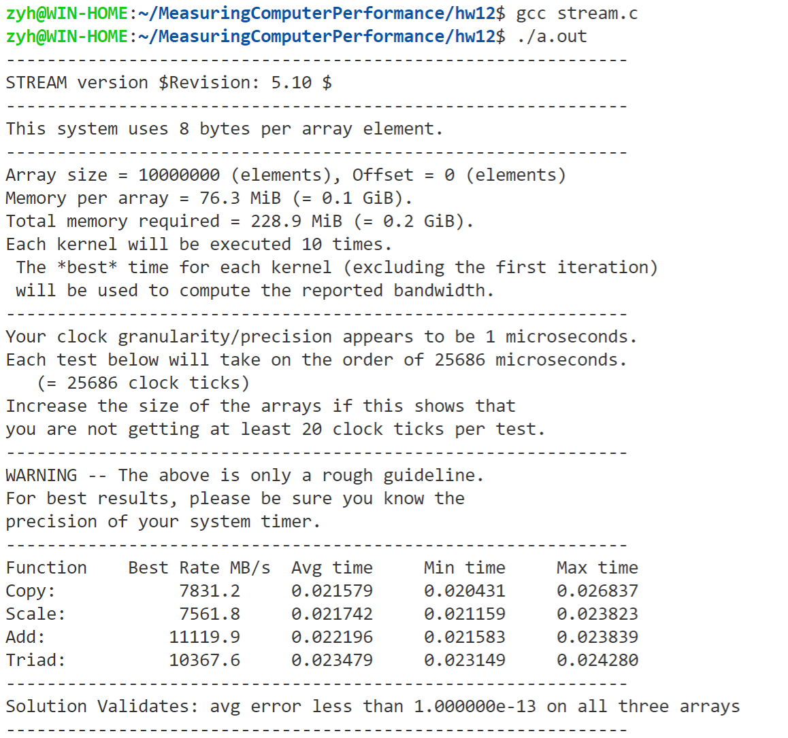
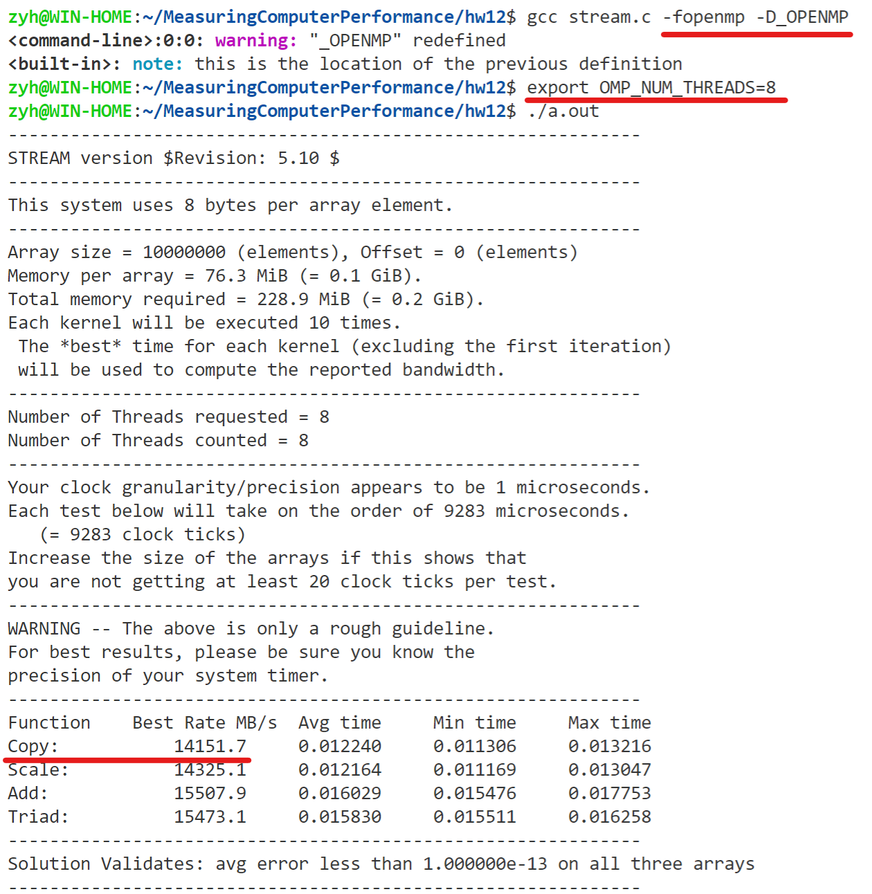

# Stream 测内存带宽

## 邹永浩

## 2019211168

### 单线程测试

直接下载`stream.c`，不加任何参数直接编译运行的结果如下

可以看到`Copy`速率为`7.8GB/s`左右，与之前作业5测试结果一致.

### 多线程测试

`Stream`支持`OpenMP`、`pthreads`和`MPI`多种模式，我们使用`OpenMP`进行测试。

可以看到，编译选项中加入`-fopenmp -D_OPENMP`，并且设置`OMP_NUM_THREADS`环境变量后，运行结果为`14GB/s`，看来单线程确实无法发挥内存的全部速度，如果是想把内存的效率发挥到最大，还是需要编写多线程程序，充分利用多核。

### 参考文献

http://www.cs.virginia.edu/stream/ref.html
