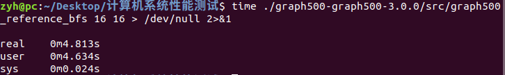
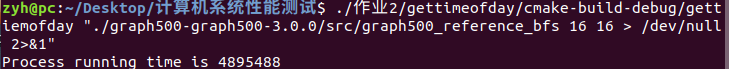
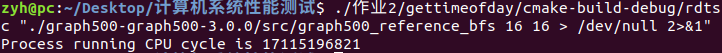

# 时间测试工具的使用

## 邹永浩
## 2019211168

### 1. `time`

还是使用`graph500`进行测试,使用`time`的结果如下:



可以看到三个结果, 其中

`real`为实际时间

`user`为用户CPU时间

`sys`为系统CPU时间

### 2. `gettimeofday`

可以写一个程序使用`gettimeofday`函数测试执行某程序的执行时间:

```c++
#include <boost/process.hpp>
#include <sys/time.h>

namespace bp = ::boost::process;

int main(int argc, char *argv[]) {
  struct timeval start {};
  struct timeval end {};
  unsigned long diff;
  gettimeofday(&start, nullptr);

  bp::child c(bp::search_path("bash"), "-c", argv[1]);
  c.wait();

  gettimeofday(&end, nullptr);
  diff = 1000000 * (end.tv_sec - start.tv_sec) + end.tv_usec - start.tv_usec;
  printf("Process running time is %ld\n", diff);
  return 0;
}
```

类似`time`, 使用该程序测试`graph500`结果如下:



可以看到, `gettimeofday` 的结果更加精确, 可以到微秒级别.

### 3. `RDTSC`

`rdtsc`指令, 可以获取CPU指令周期数, 可以利用该指令测量程序的运行时间。
同样地,可以编写一个程序进行测试:

```c++
#include <boost/process.hpp>
#include <linux/types.h>

namespace bp = ::boost::process;

__u64 rdtsc() {
  __u32 lo, hi;

  __asm__ __volatile__("rdtsc" : "=a"(lo), "=d"(hi));
  return (__u64)hi << 32u | lo;
}

int main(int argc, char *argv[]) {
  __u64 begin;
  __u64 end;

  begin = rdtsc();

  bp::child c(bp::search_path("bash"), "-c", argv[1]);
  c.wait();

  end = rdtsc();
  printf("Process running CPU cycle is %llu\n", end - begin);
  return 0;
}
```

使用该程序运行`graph500`结果如下:



由于我的CPU为`i5-4690 CPU @ 3.50GHz × 4`, 因此运行时间为:

`1/3.5/2^30*17115196821 = 4.554219762s`

可以看到, 前两种方法的时间都为`4.8s`左右, 用`rdtsc`为`4.5s`, 这种误差可能是由于进程调度所致,而`rdtsc`的结果更为精确. 

不过, 由于我是多核机器, 而且指令乱序, CPU睿频等原因, `rdtsc`的结果可能也不是最准确的, 但相比其他两种方法已经是非常好了.


### 参考文献

[多核时代不宜再用 x86 的 RDTSC 指令测试指令周期和时间 ](https://blog.csdn.net/solstice/article/details/5196544)

[使用rdtsc指令，测量程序的运行速度](http://blog.chinaunix.net/uid-24774106-id-2779245.html)

[Linux time命令](https://www.runoob.com/linux/linux-comm-time.html)

[Linux时间函数之gettimeofday](https://www.linuxidc.com/Linux/2012-06/61903.htm)

