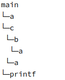
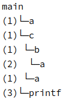
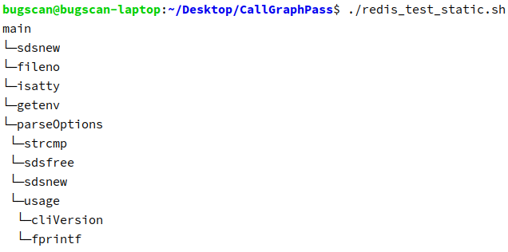
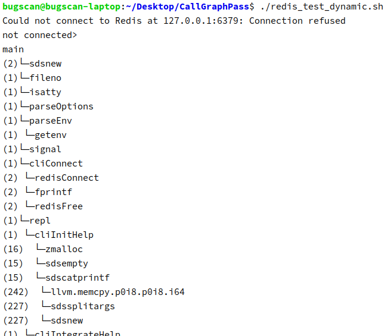

# 利用LLVM进行程序分析

## 邹永浩

## 2019211168

### 静态分析

进入函数后，遍历函数的每一条指令，如果是`call`指令，则尝试去找该指令调用的函数，能找到的话，记录一条信息。

关键代码如下：

```c++
bool StaticFunctionPass::runOnFunction(Function &F) {

    // ...

    for (auto &iter : F) {
        for (auto &bb : iter) {
            Instruction *I = &bb;
            if (auto *inst = dyn_cast_or_null<CallInst>(I)) {
                Function *called = inst->getCalledFunction());
                if (called) {
                    Node *childNode = Node::createOrGetFromVector(nodes, called->getName());
                    parentNode->addEdge(childNode);
                }
            }
        }
    }
    // ...
}

// 在Finalization时输出
bool StaticFunctionPass::doFinalization(Module &module) {
    main->print(0);
    return Pass::doFinalization(module);
}
```

运行脚本：

```bash
mkdir cmake-build-debug
cd cmake-build-debug
cmake ..
make
cd ..
clang -Xclang -load -Xclang ./cmake-build-debug/StaticFunctionPass/libStaticFunctionPass.so test.c
```

输出样例：：



可以看到，`main`调用了`a` `c` `printf`，而`c`又调用了`b` `a`， `b` 又调用 `a`，完整地显示了调用关系。

### 动态分析

动态分析可以在程序运行时记录信息，显示运行时的真正调用。

与静态分析类似，依旧编译函数的每一条指令，在函数调用前插入一条`call`指令调用我们提供的记录函数，参数为调用者和被调者的函数名，最后链接时跟我们的记录函数链接即可。

关键代码如下：

```c++
bool runOnFunction(Function &F) override {

    //...

    for (auto &bb : F) {
        for (auto &ii : bb) {
            I = &ii;
            if (auto *inst = dyn_cast_or_null<CallInst>(I)) {
                Function *called = inst->getCalledFunction();
                if (called) {
                    CallInst::Create(recordFunction, ArrayRef<Value *>{
                            CreateWords(m, F.getName()),
                            CreateWords(m, called->getName())
                    }, "", inst);
                    // 如果是exit函数，则在exit之前把信息输出
                    if (called->getName() == "exit") {
                        outs() << "call exit function\n";
                        CallInst::Create(printFunction, ArrayRef<Value *>{}, "", I);
                    }
                }
            }
        }
    }

    // 在main函数的最后一行插入输出函数，把所有信息输出
    if (F.getName() == "main") {
        CallInst::Create(printFunction, ArrayRef<Value *>{}, "", I);
    }

    // ...
}
```

运行脚本：

```bash
mkdir cmake-build-debug
cd cmake-build-debug
cmake ..
make
cd ..
clang -Xclang -load -Xclang ./cmake-build-debug/DynamicFunctionPass/libDynamicFunctionPass.so test.c -c
clang libtest.c test.o
./a.out
```

输出样例：



整体样子与静态相同，但每个调用前显示了调用的次数。

### `redis-cli`测试

可以使用较为大型的程序`redis`进行测试，编译`redis-cli`即客户端程序，静态编译命令如下：

```bash
cd ~/Desktop/redis-unstable/src # redis source dir
make # compile all first
clang -Xclang -load -Xclang \
  ~/Desktop/CallGraphPass/cmake-build-debug/StaticFunctionPass/libStaticFunctionPass.so \
  redis-cli.c \
  -I../deps/hiredis \
  -I../deps/linenoise \
  ../deps/hiredis/*.o \
  ../deps/linenoise/*.o \
  dict.o adlist.o zmalloc.o anet.o ae.o \
  ../deps/jemalloc/lib/libjemalloc.a  \
  -lpthread -lm crc16.o release.o crc64.o siphash.o -ldl
```

因为调用较多，我在源码中设置了最深为3的限制，结果如下：



后面还有很多结果，这里省略，可以直接运行源码中`redis_test_static.sh`进行测试

测试动态Pass的命令如下：

```bash
cd ~/Desktop/redis-unstable/src # redis source dir
make > /dev/null 2>&1
clang -Xclang -load -Xclang \
  ~/Desktop/CallGraphPass/cmake-build-debug/DynamicFunctionPass/libDynamicFunctionPass.so\
  redis-cli.c \
  -I../deps/hiredis \
  -I../deps/linenoise \
  -c > /dev/null 2>&1

clang redis-cli.o \
  ../deps/hiredis/*.o \
  ../deps/linenoise/*.o \
  dict.o adlist.o zmalloc.o anet.o ae.o \
  ../deps/jemalloc/lib/libjemalloc.a  \
  -lpthread -lm crc16.o release.o crc64.o siphash.o -ldl \
  ~/Desktop/CallGraphPass/libtest.c > /dev/null 2>&1
./a.out
```

结果如下：




可以看到，具体函数的调用和次数很清晰地显示出来。

具体代码见压缩包或

https://github.com/zouyonghao/CallGraphPass