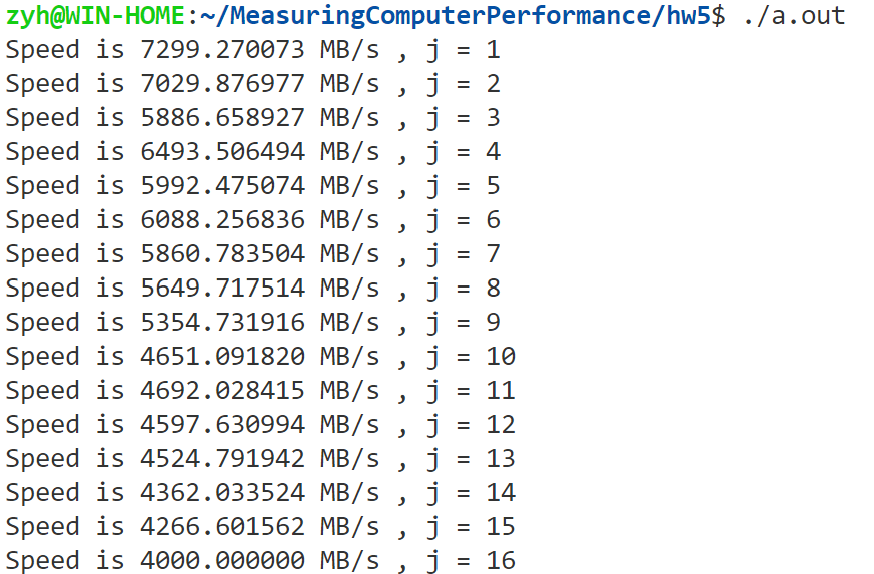
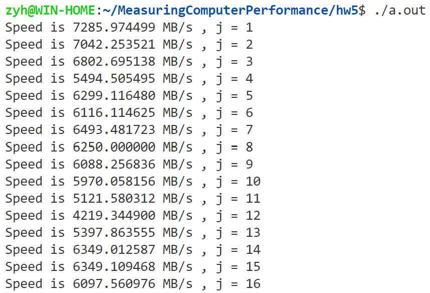

# 测量带宽

## 邹永浩

## 2019211168

### 内存到CPU的带宽

生成一个较大内存块，进行大量读测试内存到CPU的带宽，代码如下：

```c
#include <stdio.h>
#include <linux/types.h>
#include <sys/time.h>

int main()
{
    struct timeval start;
    struct timeval end;
    unsigned long diff;
    //需要测试的数组大小
    __u32 size = 1 << 19;
    volatile int sink;
    __u64 data[size];
    for (int i = 0; i < size; i++)
    {
        data[i] = 0;
    }

    int result = 0;

    // try warmup
    for (int i = 0; i < size; i++)
    {
        result += data[i];
    }

    // 步长
    for (int j = 1; j < 17; j++)
    {
        result = 0;
        gettimeofday(&start, NULL);
        for (int i = 0; i < size; i += j)
        {
            result += data[i];
        }
        sink = result;
        gettimeofday(&end, NULL);
        diff = 1000000 * (end.tv_sec - start.tv_sec) + end.tv_usec - start.tv_usec;
        printf("Speed is %f MB/s , j = %d\n", size / j * 16 / 1024.0 / 1024.0 / diff * 1000000, j);
    }
}
```

结果如下：



可以看到，在步长较小时，带宽约为7GB/s，考虑到我的机器是DDR3 1666MHz，理论上只能到10GB，因此这个速度也是符合预期的。随着步长增大，可以认为接近随机访问，可以看到性能大概在4GB/s左右。

### Cache 到 CPU 的带宽

我的CPU是`i5 4690`，L3 Cache 为 6MB，如果使用上述方式测试，考虑把分配的数组大小限制在6MB以内进行测试，结果如下：



可以看到步长增加时速度变化较之前变小。

但是这种方式不能明显表示 Cache 带宽，所以还是要用其他方式。参考网上相关资料，使用如下代码：

`cache.c`
```c
#include <stdio.h>
#include <stdlib.h>
#include <linux/types.h>
#include <sys/time.h>

extern int Reader(void *ptr, unsigned long size, unsigned long loops);

int main()
{
    struct timeval start;
    struct timeval end;
    unsigned long diff;

    // for cache
    __u32 size = 1 << 10;

    volatile int sink;
    __u64 *data = malloc(sizeof(__u64) * size);
    if (data == NULL)
    {
        printf("malloc failed\n");
        exit(0);
    }
    for (int i = 0; i < size; i++)
    {
        data[i] = i;
    }

    int loop = 100000;
    gettimeofday(&start, NULL);
    Reader(data, size, loop);
    gettimeofday(&end, NULL);
    diff = 1000000 * (end.tv_sec - start.tv_sec) + end.tv_usec - start.tv_usec;
    long double result = (long double)size * loop / 1048576 / diff * 1000000;
    printf("Speed is %Lf MB/s\n", result);
    free(data);
}
```

`read.asm`
```asm
%define P1 rdi
%define P2 rsi
%define P3 rdx
%define P4 rcx

bits	64
cpu	ia64

global	Reader
global	_Reader

	section .text
;------------------------------------------------------------------------------
; Name:		Reader
; Purpose:	Reads 64-bit values sequentially from an area of memory.
; Params:	P1 = ptr to memory area
; 		P2 = length in bytes
; 		P3 = loops
;------------------------------------------------------------------------------
	align 64
Reader:
_Reader:
	push	r10

	add	P2, P1	; P2 now points to end.

.L1:
	mov	r10, P1

.L2:
	mov	rax, [r10]
	mov	rax, [8+r10]
	mov	rax, [16+r10]
	mov	rax, [24+r10]
	mov	rax, [32+r10]
	mov	rax, [40+r10]
	mov	rax, [48+r10]
	mov	rax, [56+r10]
	mov	rax, [64+r10]
	mov	rax, [72+r10]
	mov	rax, [80+r10]
	mov	rax, [88+r10]
	mov	rax, [96+r10]
	mov	rax, [104+r10]
	mov	rax, [112+r10]
	mov	rax, [120+r10]
	mov	rax, [128+r10]
	mov	rax, [136+r10]
	mov	rax, [144+r10]
	mov	rax, [152+r10]
	mov	rax, [160+r10]
	mov	rax, [168+r10]
	mov	rax, [176+r10]
	mov	rax, [184+r10]
	mov	rax, [192+r10]
	mov	rax, [200+r10]
	mov	rax, [208+r10]
	mov	rax, [216+r10]
	mov	rax, [224+r10]
	mov	rax, [232+r10]
	mov	rax, [240+r10]
	mov	rax, [248+r10]

	add	r10, 256
	cmp	r10, P2
	jb	.L2

	dec	P3
	jnz	.L1

	pop	r10
	ret
```

使用汇编减少编译器优化和相关干扰，运行结果如下：


可以粗略估计 L3 cache 读速度为 60GB/s 左右。