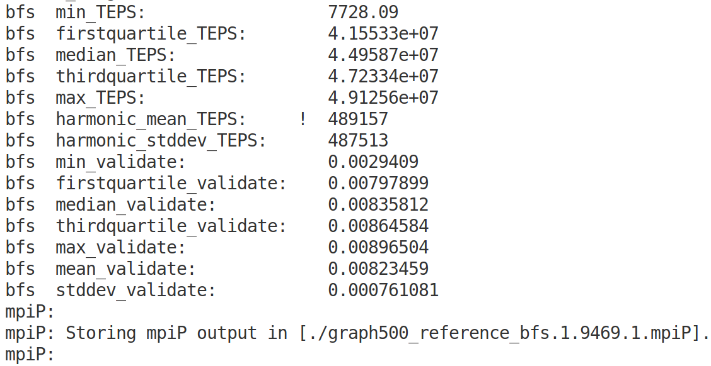

# 学习使用mpiP工具

## 邹永浩

## 2019211168

### 编译 `mpiP`

`Ubuntu` 下编译 `mpiP` 需要安装 `unwind` 和 `gfortran`

```bash
sudo apt install libunwind-dev
sudo apt install gfortran
./configure
make
```

### 编译 `Graph500`

编译之前同样需要安装相关库

```bash
sudo apt install binutils-dev
sudo apt install libiberty-dev
```

然后修改编译脚本如下:

```
graph500_reference_bfs: bfs_reference.c $(SOURCES) $(HEADERS) $(GENERATOR_SOURCES) csr_reference.c
	$(MPICC) $(CFLAGS) $(LDFLAGS) -o graph500_reference_bfs\
         bfs_reference.c csr_reference.c $(SOURCES) $(GENERATOR_SOURCES) \
        -lm -L/home/zyh/Desktop/mpiP-3.4.1/ -lmpiP -lbfd -liberty -lunwind
```

此时运行程序后会出现如下结果:



### 分析结果

```
./graph500_reference_bfs 16 128
```

查看分析结果如下:
```
@ mpiP
@ Command : ./graph500_reference_bfs 16 128
@ Version                  : 3.4.1
@ MPIP Build date          : Apr  9 2020, 10:58:23
@ Start time               : 2020 04 09 12:06:37
@ Stop time                : 2020 04 09 12:07:12
@ Timer Used               : PMPI_Wtime
@ MPIP env var             : [null]
@ Collector Rank           : 0
@ Collector PID            : 9862
@ Final Output Dir         : .
@ Report generation        : Single collector task
@ MPI Task Assignment      : 0 pc

---------------------------------------------------------------------------
@--- MPI Time (seconds) ---------------------------------------------------
---------------------------------------------------------------------------
Task    AppTime    MPITime     MPI%
   0       34.5     0.0299     0.09
   *       34.5     0.0299     0.09
---------------------------------------------------------------------------
@--- Callsites: 48 --------------------------------------------------------
---------------------------------------------------------------------------
 ID Lev File/Address        Line Parent_Funct             MPI_Call
  1   0 0x55d2d30e7e70           [unknown]                Start
  2   0 0x55d2d30e7a67           [unknown]                Recv_init
  3   0 0x55d2d30e3c4a           [unknown]                Type_free
////略掉一部分
---------------------------------------------------------------------------
@--- Aggregate Time (top twenty, descending, milliseconds) ----------------
---------------------------------------------------------------------------
Call                 Site       Time    App%    MPI%     COV
Test                   29       6.98    0.02   23.36    0.00
Testany                44       4.21    0.01   14.10    0.00
Test                   20       3.99    0.01   13.36    0.00
Testany                24       3.89    0.01   13.03    0.00
Testany                 7       3.82    0.01   12.80    0.00
Barrier                31       3.22    0.01   10.78    0.00
Allreduce              22      0.948    0.00    3.17    0.00
Allreduce              42      0.787    0.00    2.63    0.00
Allreduce              25      0.437    0.00    1.46    0.00
Allreduce              19      0.303    0.00    1.01    0.00
Allreduce              21      0.228    0.00    0.76    0.00
Allreduce              23      0.205    0.00    0.69    0.00
Allreduce               6      0.164    0.00    0.55    0.00
Cart_create            30      0.152    0.00    0.51    0.00
Bcast                  45      0.082    0.00    0.27    0.00
Comm_split             47     0.0627    0.00    0.21    0.00
Recv_init              10       0.05    0.00    0.17    0.00
Recv_init               2     0.0424    0.00    0.14    0.00
Isend                  34     0.0309    0.00    0.10    0.00
Wait                    4     0.0211    0.00    0.07    0.00
---------------------------------------------------------------------------
@--- Aggregate Sent Message Size (top twenty, descending, bytes) ----------
---------------------------------------------------------------------------
Call                 Site      Count      Total       Avrg  Sent%
Allreduce              22        326   2.61e+03          8  35.65
Allreduce              42        261   2.09e+03          8  28.54
Allreduce               6         65        520          8   7.11
Allreduce              19         65        520          8   7.11
Allreduce              21         65        520          8   7.11
Allreduce              25         64        512          8   7.00
Allreduce              23         67        268          4   3.66
Bcast                  45          1        256        256   3.50
Allreduce               8          1          8          8   0.11
Allreduce              17          1          8          8   0.11
Allreduce              32          1          8          8   0.11
---------------------------------------------------------------------------
@--- Callsite Time statistics (all, milliseconds): 48 ---------------------
---------------------------------------------------------------------------
Name              Site Rank  Count      Max     Mean      Min   App%   MPI%
Allreduce            6    0     65  0.00269  0.00252  0.00247   0.00   0.55
Allreduce            6    *     65  0.00269  0.00252  0.00247   0.00   0.55

Allreduce            8    0      1  0.00306  0.00306  0.00306   0.00   0.01
Allreduce            8    *      1  0.00306  0.00306  0.00306   0.00   0.01

Allreduce           17    0      1  0.00327  0.00327  0.00327   0.00   0.01
Allreduce           17    *      1  0.00327  0.00327  0.00327   0.00   0.01
////略掉一部分
---------------------------------------------------------------------------
@--- Callsite Message Sent statistics (all, sent bytes) -------------------
---------------------------------------------------------------------------
Name              Site Rank   Count       Max      Mean       Min       Sum
Allreduce            6    0      65         8         8         8       520
Allreduce            6    *      65         8         8         8       520

Allreduce            8    0       1         8         8         8         8
Allreduce            8    *       1         8         8         8         8
////略掉一部分
---------------------------------------------------------------------------
@--- End of Report --------------------------------------------------------
---------------------------------------------------------------------------

```

可以看到,报告的第一部分描述了程序的大概情况,包括程序的命令,时间等.

第二部分有一个程序运行时间和MPI时间,可以看到整体MPI所占时间还是比较少的,本次运行程序的计算部分还是主要部分,可能因为只是在运行时,线程较少,而且程序本身需要多线程交互的地方不多.

第三部分描述了部分函数调用的位置,由于我没开调试信息,此处显示信息较少.

后面几个部分可以看到MPI函数调用最多的前几个的时间,发送的信息量等,可以看到 `Allreduce` 在调用中占了多数,如果程序出现瓶颈可以考虑优化减少相关调用.

