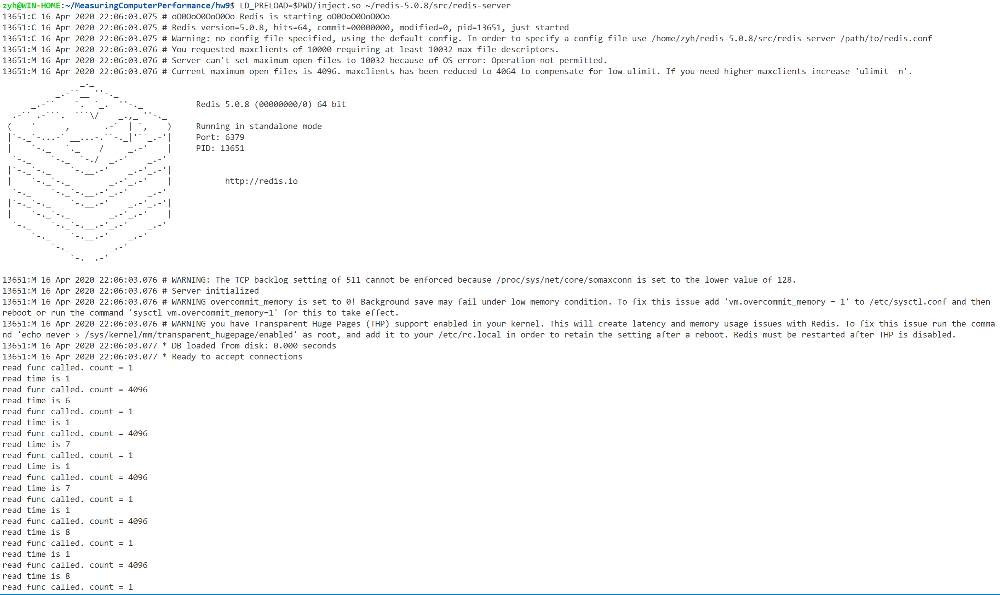

# IO profile和trace的插桩库

## 邹永浩

## 2019211168

### `LD_PRELOAD` 测试

劫持 `read` 和 `write` 函数

```c
typedef ssize_t (*WRITE)(int fd, const void *buf, size_t count);

int write(int fd, const void *buf, size_t count)
{
    static void *handle = NULL;
    static WRITE old_write = NULL;

    if (!handle)
    {
        handle = dlopen("libc.so.6", RTLD_LAZY);
        old_write = (WRITE)dlsym(handle, "write");
    }
    printf("write func called. count = %ld\n", count);
    return old_write(fd, buf, count);
}

typedef ssize_t (*READ)(int fd, void *buf, size_t count);

int read(int fd, void *buf, size_t count)
{
    static void *handle = NULL;
    static WRITE old_write = NULL;

    if (!handle)
    {
        handle = dlopen("libc.so.6", RTLD_LAZY);
        old_write = (WRITE)dlsym(handle, "read");
    }
    printf("read func called. count = %ld\n", count);
    return old_write(fd, buf, count);
}
```

编译指令为：

```bash
gcc inject.c -shared -fPIC -DPIC -o inject.so -ldl
```

运行 `cat` 可以看到成功捕获函数:


### 添加 Profile 和 Trace相关代码

```c

int write(int fd, const void *buf, size_t count)
{
    total_write_count++;
    total_write_size += count;

    // ...
    printf("write func called. count = %ld\n", count);
    struct timeval start;
    struct timeval end;
    unsigned long diff;
    gettimeofday(&start, NULL);
    int result = old_write(fd, buf, count);

    gettimeofday(&end, NULL);
    diff = 1000000 * (end.tv_sec - start.tv_sec) + end.tv_usec - start.tv_usec;
    printf("write time is %ld\n", diff);
    total_write_time += diff;
    return result;
}

void print_statistics()
{
    printf("total read is %ld\n", total_read_count);
    printf("total write is %ld\n", total_write_count);
    printf("average read size is %f\n", (double)total_read_size / total_read_count);
    printf("average write size is %f\n", (double)total_write_size / total_write_count);
    printf("average read time is %f\n", total_read_time / total_read_count);
    printf("average write time is %f\n", total_write_time / total_write_count);
}

typedef void (*EXIT)(int status) __attribute__((noreturn));

// 如果调用exit则输出统计结果
void exit(int status)
{
    printf("exit func called.\n");
    print_statistics();
    static void *handle = NULL;
    static EXIT old_exit = NULL;

    if (!handle)
    {
        handle = dlopen("libc.so.6", RTLD_LAZY);
        old_exit = (EXIT)dlsym(handle, "exit");
    }

    old_exit(status);
}

// 如果main函数结束则输出统计结果
__attribute__((destructor)) void main() {
    print_statistics();
}

```

### 测试`redis`

```bash
LD_PRELOAD=$PWD/inject.so ~/redis-5.0.8/src/redis-server
```

可以看到程序会一直输出`Trace`信息



程序结束时输出统计信息如下：


### 参考文献

https://www.jianshu.com/p/f78b16bd8905

https://www.cnblogs.com/LittleHann/p/3854977.html#_lab2_2_0

https://www.tutorialspoint.com/unix_system_calls/read.htm